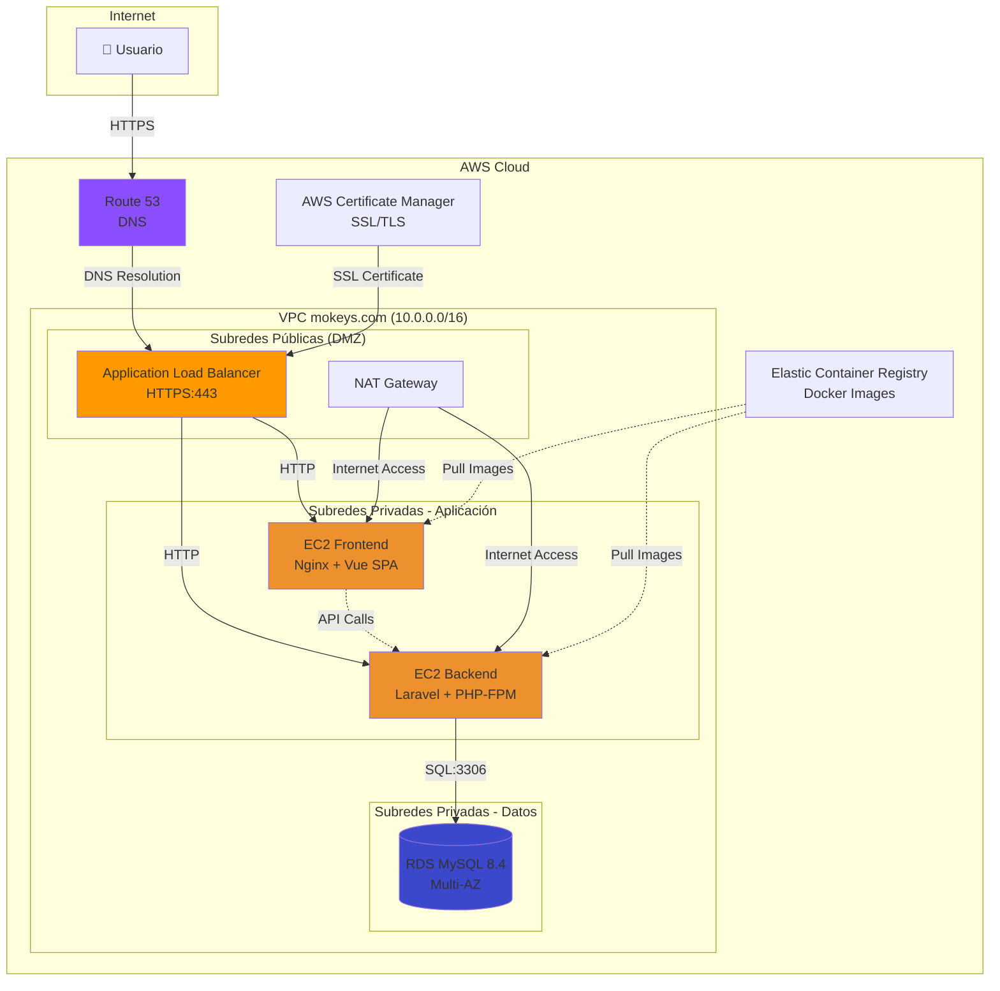

# Arquitectura del Sistema MOKeys

## 🏗️ Visión General

MOKeys es una aplicación web de gestión de productos construida con arquitectura moderna separando frontend y backend:

- **Frontend**: Vue 3 (SPA) con Pinia y Vue Router
- **Backend**: Laravel 11 API REST con autenticación Sanctum
- **Base de Datos**: MySQL 8.4
- **Infraestructura**: AWS con Docker

---

## 📐 Diagrama de Arquitectura AWS



---

## 🌐 Configuración de Red (VPC)

### VPC Principal
- **CIDR Block**: `10.0.0.0/16`
- **DNS Hostname**: Habilitado
- **DNS Resolution**: Habilitado

### Subredes

#### Públicas (ALB y NAT Gateway)
| Nombre          | CIDR        | AZ         | Uso       |
| --------------- | ----------- | ---------- | --------- |
| Public Subnet 1 | 10.0.1.0/24 | us-east-1a | ALB + NAT |
| Public Subnet 2 | 10.0.2.0/24 | us-east-1b | ALB (HA)  |

#### Privadas - Aplicación
| Nombre       | CIDR         | AZ         | Uso                |
| ------------ | ------------ | ---------- | ------------------ |
| App Subnet 1 | 10.0.10.0/24 | us-east-1a | Frontend + Backend |
| App Subnet 2 | 10.0.11.0/24 | us-east-1b | Escalabilidad      |

#### Privadas - Datos
| Nombre        | CIDR         | AZ         | Uso                    |
| ------------- | ------------ | ---------- | ---------------------- |
| Data Subnet 1 | 10.0.20.0/24 | us-east-1a | RDS Principal          |
| Data Subnet 2 | 10.0.21.0/24 | us-east-1b | RDS Standby (Multi-AZ) |

### Tablas de Rutas

**Public Route Table**:
- `0.0.0.0/0` → Internet Gateway

**Private Route Table (App)**:
- `0.0.0.0/0` → NAT Gateway (para updates/ECR)

**Private Route Table (Data)**:
- Solo tráfico interno VPC (sin acceso a Internet)

---

## 🔒 Security Groups

### ALB Security Group
| Tipo     | Puerto | Origen    | Descripción              |
| -------- | ------ | --------- | ------------------------ |
| Inbound  | 443    | 0.0.0.0/0 | HTTPS público            |
| Inbound  | 80     | 0.0.0.0/0 | HTTP (redirect to HTTPS) |
| Outbound | Todos  | App SG    | Hacia aplicaciones       |

### App Security Group (Frontend + Backend)
| Tipo     | Puerto | Origen           | Descripción           |
| -------- | ------ | ---------------- | --------------------- |
| Inbound  | 80     | ALB SG           | Tráfico desde ALB     |
| Inbound  | 22     | Bastion/Admin IP | SSH management        |
| Outbound | 3306   | Data SG          | Queries MySQL         |
| Outbound | 443    | 0.0.0.0/0        | Updates/APIs externas |

### Data Security Group (RDS)
| Tipo     | Puerto | Origen | Descripción        |
| -------- | ------ | ------ | ------------------ |
| Inbound  | 3306   | App SG | Solo desde backend |
| Outbound | -      | -      | Sin salida         |

---

## 🗄️ Capa de Datos - RDS

### Configuración RDS MySQL

- **Tipo**: db.t3.micro (elegible Free Tier)
- **Engine**: MySQL 8.4
- **Multi-AZ**: Activado (alta disponibilidad)
- **Storage**: 20GB GP3, autoscaling hasta 100GB
- **Backup**:
  - Retención: 7 días
  - Ventana: 03:00-04:00 UTC
  - Snapshots automáticos diarios
- **Read Replica**: (Opcional) 1 réplica en us-east-1b
- **Encryption**: Habilitada en reposo (KMS)

### Estrategia de Backup

1. **Snapshots Automáticos**: Diarios a las 03:00 UTC
2. **Snapshots Manuales**: Antes de cada despliegue grande
3. **Retención**: 7 días para automáticos, indefinido para manuales
4. **Restore Point Objective (RPO)**: 24 horas
5. **Recovery Time Objective (RTO)**: < 1 hora

---

## 🚦 Capa de Entrada (Edge)

### Application Load Balancer (ALB)

**Listeners**:
- **Puerto 443 (HTTPS)**:
  - Certificado: Let's Encrypt via ACM
  - Target Group: EC2 Frontend (puerto 80) + EC2 Backend (puerto 80)
  - Health Check: `GET /` (Frontend) y `GET /api/health` (Backend)
  
- **Puerto 80 (HTTP)**:
  - Acción: Redirect permanente a HTTPS

**Routing Rules**:
```
Host: mokeys.com        → Target: Frontend
Host: api.mokeys.com    → Target: Backend
Path: /api/*                     → Target: Backend
Default                          → Target: Frontend
```

---

## 🖥️ Capa de Aplicación

### EC2 Frontend
- **AMI**: Amazon Linux 2023
- **Instance Type**: t3.small
- **Docker**: Ejecuta contenedor `mokeys-frontend:latest`
- **Auto Scaling** (Opcional):
  - Min: 1, Max: 3
  - Scale Up: CPU > 70% por 5 min
  - Scale Down: CPU < 30% por 10 min

### EC2 Backend
- **AMI**: Amazon Linux 2023
- **Instance Type**: t3.small
- **Docker**: Ejecuta contenedor `mokeys-backend:latest`
- **Auto Scaling** (Opcional): Misma configuración que frontend

---

## 🌍 DNS - Route 53

### Zona Delegada: `mokeys.com`

| Record | Type  | Value              | TTL |
| ------ | ----- | ------------------ | --- |
| @      | A     | ALB DNS (Alias)    | 300 |
| api    | A     | ALB DNS (Alias)    | 300 |
| www    | CNAME | mokeys.com | 300 |

### Delegación en Zona Padre (`ddaw.es`)

Proporcionar al administrador:
```
mokeys.com.  NS  ns-1234.awsdns-12.org.
mokeys.com.  NS  ns-5678.awsdns-56.com.
```

---

## 🔐 HTTPS con Let's Encrypt

### Certificado SSL/TLS

**Opción 1: AWS Certificate Manager (ACM)** ✅ Recomendado
1. Solicitar certificado en ACM para `*.mokeys.com`
2. Validación DNS (añadir CNAME a Route 53)
3. Asignar certificado al ALB
4. Renovación automática gratis

**Opción 2: Certbot en EC2**
```bash
# Instalar Certbot
sudo snap install --classic certbot

# Obtener certificado
sudo certbot --nginx -d mokeys.com -d api.mokeys.com

# Renovación automática (crontab)
0 0 * * * certbot renew --quiet
```

---

## 🔄 Flujo de Tráfico

1. Usuario accede a `https://mokeys.com`
2. Route 53 resuelve a IP del ALB
3. ALB termina SSL y enruta a EC2 Frontend
4. Frontend sirve SPA Vue
5. Usuario hace login → Frontend llama a `https://api.mokeys.com/login`
6. ALB enruta a EC2 Backend
7. Backend valida contra RDS MySQL
8. Respuesta JSON → Frontend actualiza estado Pinia

---

## 📊 Escalabilidad

### Horizontal (Recomendado)

- **Auto Scaling Groups** para EC2 Frontend y Backend
- **ALB** distribuye tráfico entre instancias
- **RDS Read Replicas** para queries de lectura pesadas

### Vertical

- Aumentar instance types (t3.small → t3.medium → t3.large)
- Aumentar RDS storage y IOPS

### Almacenamiento

- **S3** para assets estáticos (imágenes de productos)
- **CloudFront CDN** delante de S3 para baja latencia global

---

## 💰 Estimación de Costos (Mensual)

| Servicio                         | Configuración  | Costo Estimado |
| -------------------------------- | -------------- | -------------- |
| EC2 (2x t3.small)                | 24/7           | ~$30           |
| RDS MySQL (db.t3.micro Multi-AZ) | 24/7           | ~$25           |
| ALB                              | 24/7 + tráfico | ~$20           |
| NAT Gateway                      | 24/7 + tráfico | ~$35           |
| Route 53                         | 1 zona hosted  | $0.50          |
| Data Transfer                    | Estimado 10GB  | ~$1            |
| **TOTAL**                        |                | **~$111/mes**  |

> **Nota**: Costos reductibles usando Free Tier (primer año) o apagando recursos en horarios no lectivos.

---

## 🛠️ Mantenimiento

### Backups Automáticos
- RDS: Snapshots diarios automáticos
- EC2: AMIs semanales de instancias configuradas

### Actualizaciones
- **Sistema Operativo**: `sudo yum update` mensual
- **Docker Images**: CI/CD automático en cada push
- **Dependencias PHP/Node**: Renovar cada 3 meses

### Monitoreo
- **CloudWatch**: Métricas CPU, RAM, Network
- **CloudWatch Logs**: Logs de aplicación centralizados
- **Alarmas**: Notificar si CPU > 80% o RDS connections > 90

---

## 📞 Soporte

**Equipo**: Marcos Pérez & Óscar Calatayud  
**Email**: [contacto]  
**Repositorio**: https://github.com/[usuario]/mokeys
